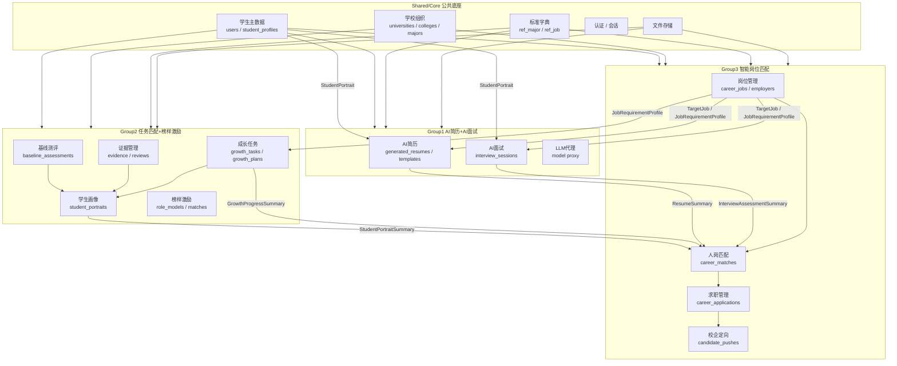

# 薪火未来 — 业务数据流

> 三组之间的核心数据依赖关系和读写边界

---

## 数据流总览



---

## 关键数据契约 (DTO / Schema)

这些是跨组调用的公共接口定义。必须统一，不允许各组自行定义不同版本。

### Shared → All

| DTO | 来源 | 使用方 | 说明 |
|-----|------|--------|------|
| `StudentSummary` | Shared/users | Group1,2,3 | 学生基本信息（不含敏感字段） |
| `StudentProfile` | Shared/users | Group1,2,3 | 学生完整档案 |
| `CollegeInfo` | Shared/organization | Group2,3 | 学院基本信息 |
| `MajorProgramInfo` | Shared/organization | Group2,3 | 专业信息 |
| `JobStandardRef` | Shared/reference | Group1,2,3 | 标准岗位分类 |
| `FileRef` | Shared/files | Group1,2,3 | 文件元数据引用 |

### Group2 → Group1 & Group3

| DTO | 来源 | 使用方 | 说明 |
|-----|------|--------|------|
| `StudentPortraitSummary` | Group2/portrait | Group1,3 | 五维能力画像摘要 |
| `GrowthProgressSummary` | Group2/growth | Group3 | 成长任务完成情况摘要 |
| `BaselineAssessmentSummary` | Group2/assessment | Group3 | 基线测评摘要 |

### Group1 → Group3

| DTO | 来源 | 使用方 | 说明 |
|-----|------|--------|------|
| `ResumeSummary` | Group1/resume | Group3 | AI简历摘要（含版本信息） |
| `InterviewAssessmentSummary` | Group1/interview | Group3 | 面试评估摘要（含分数和短板） |

### Group3 → Group1 & Group2

| DTO | 来源 | 使用方 | 说明 |
|-----|------|--------|------|
| `TargetJob` | Group3/career | Group1,2 | 目标岗位信息（含JD） |
| `JobRequirementProfile` | Group3/career | Group1,2 | 岗位要求结构化解析结果 |
| `JobMatchResult` | Group3/career | Group2 | 匹配结果（含能力缺口） |

---

## 数据写权限原则

```
┌──────────┬──────────┬──────────┬──────────┐
│  Table   │  Shared  │  Group1  │  Group2  │  Group3  │
├──────────┼──────────┼──────────┼──────────┼──────────┤
│  users   │   RW     │    R     │    R     │    R     │
│  student │   RW     │    R     │    R     │    R     │
│  resume  │    R     │   RW     │    R     │    R     │
│  portrait│    R     │    R     │   RW     │    R     │
│  jobs    │    R     │    R     │    R     │   RW     │
└──────────┴──────────┴──────────┴──────────┴──────────┘

RW = Read/Write (Owner)
R  = Read Only
```

---

## 典型业务流程

### 1. 新生入学 → 基线测评

```
Shared: 学生注册 + 招生数据录入
  → Group2: 基线测评 (BaselineAssessment)
  → Group2: 生成画像 (StudentPortrait)
  → Group2: 推荐学期成长计划 (GrowthPlan/GrowthTask)
```

### 2. 学生求职准备

```
Group3: 学生浏览/导入岗位 (CareerJob)
  → Group1: 根据岗位JD生成定制简历 (GeneratedResume)
  → Group1: 进行模拟面试 (InterviewSession)
  → Group1: 获得面试评估 (InterviewAssessment)
```

### 3. 人岗匹配

```
Group3: 读取Group2的StudentPortrait
  → Group3: 读取Group1的ResumeSummary + InterviewAssessment
  → Group3: 综合匹配计算 (CareerMatch)
  → Group3: 生成匹配报告 + 能力缺口
  → Group2: 接收能力缺口, 调整成长任务 (via GrowthPlan)
```

### 4. 校企定向推送

```
Group3: 企业发布定向岗位
  → Group3: 匹配候选人 (CareerMatch)
  → Group3: 发起推送 (CandidatePush)
  → Shared: 学生收到通知
  → Shared: 学生授权 (StudentDataAuthorization)
  → Group3: 企业查看授权范围内的学生数据
```

---

## 更新记录

| 日期 | 变更 | 作者 |
|------|------|------|
| 2026-08-10 | Phase 1.1 — 基于正式功能文档重新设计 | Architecture Team |
